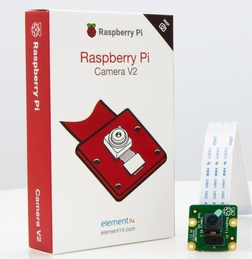

# Onderzoeksrapport: Raspberry Pi - Camera v2
### *Hannes De Baere - Nawang Tendar*


## Raspbeery Pi Camera v2 module features
De Raspberry Pi Camera V2 heeft een 8 megapixel Sony IMX219 image sensor met een vaste focus lens, het is mogelijk om 3280x2464px afbeeldingen te maken, and het ondersteund 1080p30, 720p60, en 640x480p90 video. De camera is compatibel met alle Raspberry Pi modellen. 

## De Raspberry Pi Camera module activeren


Om de Raspberry Pi Camera module te gebruiken moet je de camera software op je Raspberry Pi activeren. In de desktop omgeving doe je dit als volgt: ga naar het Raspberry Pi configuratie scherm onder voorkeuren, open de interface tab, en zet de camera aan, zoals getoond in onderstaande afbeelding 
Of je kunt dit ook doen via de terminal met het volgende commando:
> sudo raspi-config

Dan zou je de Raspberry Pi software configuratie moeten zien, selecteer dan de interface optie:


Activeer de camera en reboot de Pi:


## De camera verbinden

De Raspberry Pi Camera Module verbinden is gemakkelijk. Eerst en vooral moet je zorgen dat de Pi uit staat, dan verbindt je de camera aan de Pi via de CSI poort zoals getoond wordt op de volgende afbeelding. Zorg ervoor dat de camera is verbonden in de juiste richting, met de blauwe letters omhoog zoals op de afbeelding te zien is.

## Een foto maken en opslaan
De makkelijkste manier om de Raspberry Pi Camera te gebruiken is met de Python PiCamera package.
We gaan eerst een nieuwe file maken genaamd **take_photo.py**.

>nano take_photo.py

Om de camera te gebruiken moeten we deze importeren in onze file, vervolgens bepalen we de resolutie, tonen we een preview, en vervolgens slaan we de foto op. Dit alles kan met de volgende code:
```python
from time import sleep
from picamera import PiCamera
 
camera = PiCamera()
camera.resolution = (1024, 768)
camera.start_preview()
sleep(2)
camera.capture(‘test_photo.jpg’)
```
Met de volgende code kun je het script runnen:


> python take_photo.py

Dit commando neemt dan een foto met de Raspberry Pi Camera en slaat dit op onder de naam **test_photo.jpg**:


## Een video opnemen en opslaan
We gaan eerst een nieuwe file maken genaamd **record_video.py**.

 
> nano record_video.py

Om de camera te gebruiken moeten we deze importeren in onze file, vervolgens bepalen we de resolutie, tonen we een preview, en vervolgens slaan we de video op. Dit alles kan met de volgende code:

```python
from time import sleep
from picamera import PiCamera
 
camera = PiCamera()
camera.resolution = (640, 480)
 
camera.start_preview(‘test_video.h264’)
camera.start_recording()
sleep(5)
camera.stop_recording()
 
print(‘Finished recording’)
```
Met de volgende code kun je het script runnen:

> python record_video.py

Dit commando maakt dan een video van 5 seconden met de Raspberry Pi Camera en slaat dit op onder de naam **test_video.h264**. Om de video weer te geven op de Raspberry Pi met de Raspbian Desktop environment, kun je de omxplayer software gebruiken met het volgende commando in de terminal.

 
> omxplayer test_video.h264

## De camera instellen voor livestream
Voordat we de camera kunnen gebruiken voor livestream moet je zorgen dat alle voorgaande stappen zijn doorlopen. Om de livestream op te zetten beginnen we met een nieuw bestand aan te maken:

 
> nano webcam_system.py

Vervolgens open je dat bestand, we gaan stap voor stap de code blokken toevoegen. Als eerste doen we al onze imports met onderstaande code:
 
```python
import io
import picamera
import logging
import SocketServer
from threading import Condition
import BaseHTTPServer
server = BaseHTTPServer
```
Vervolgens gaan we html opmaak meegeven voor als iemand naar onze livestream surft.
```python
PAGE="""\
<html>
<head>
<title>Raspberry Pi - Surveillance Camera</title>
</head>
<body>
<center><h1>Raspberry Pi - Surveillance Camera</h1></center>
<center></center>
</body>
</html>
"""
```

Dan gaan we een class aanmaken genaamt StreamingOutput die de streaming op gang gaat zetten.

```python 
class StreamingOutput(object):
    def __init__(self):
        self.frame = None
        self.buffer = io.BytesIO()
        self.condition = Condition()
 
    def write(self, buf):
        if buf.startswith(b'\xff\xd8'):
            # New frame, copy the existing buffer's content and notify all
            # clients it's available
            self.buffer.truncate()
            with self.condition:
                self.frame = self.buffer.getvalue()
                self.condition.notify_all()
            self.buffer.seek(0)
        return self.buffer.write(buf)
```

Vervolgens gaan we nog een class toevoegen genaamd StreamingHandler die de server gaat initialiseren.

```python 
class StreamingHandler(server.BaseHTTPRequestHandler):
    def do_GET(self):
        if self.path == '/':
            self.send_response(301)
            self.send_header('Location', '/index.html')
            self.end_headers()
        elif self.path == '/index.html':
            content = PAGE.encode('utf-8')
            self.send_response(200)
            self.send_header('Content-Type', 'text/html')
            self.send_header('Content-Length', len(content))
            self.end_headers()
            self.wfile.write(content)
        elif self.path == '/stream.mjpg':
            self.send_response(200)
            self.send_header('Age', 0)
            self.send_header('Cache-Control', 'no-cache, private')
            self.send_header('Pragma', 'no-cache')
            self.send_header('Content-Type', 'multipart/x-mixed-replace; boundary=FRAME')
            self.end_headers()
            try:
                while True:
                    with output.condition:
                        output.condition.wait()
                        frame = output.frame
                    self.wfile.write(b'--FRAME\r\n')
                    self.send_header('Content-Type', 'image/jpeg')
                    self.send_header('Content-Length', len(frame))
                    self.end_headers()
                    self.wfile.write(frame)
                    self.wfile.write(b'\r\n')
            except Exception as e:
                logging.warning(
                    'Removed streaming client %s: %s',
                    self.client_address, str(e))
        else:
            self.send_error(404)
            self.end_headers()
```
En dan maken we nog een derde class aan genaamd StreamingServer waar we nog enkele configuraties gaan doen.

```python
class StreamingServer(socketserver.ThreadingMixIn, server.HTTPServer):
    allow_reuse_address = True
    daemon_threads = True
```
Als laatste voegen we nog één blok code toe die alles gaat runnen. Indien de camera gedraaid staat, dan kun je ook de hashtag verwijderen voor camera.rotation, en het getal aanpassen totdat de camera juist staat.

```python
with picamera.PiCamera(resolution='640x480', framerate=24) as camera:
    output = StreamingOutput()
    #Uncomment the next line to change your Pi's Camera rotation (in degrees)
    #camera.rotation = 90
    camera.start_recording(output, format='mjpeg')
    try:
        address = ('', 8000)
        server = StreamingServer(address, StreamingHandler)
        server.serve_forever()
    finally:
        camera.stop_recording()
```

Om de server online te zetten run je in de terminal de volgende command:

 
> webcam_system.py
 

Om naar de livestream te surfen moet je eerst je ip adres van de raspberry pi opvragen met onderstaand commando:

 
> ifconfig
 

Vervolgens kun je naar de livestream surfen met <span style="color:red;">**Your_Pi_IP_Address**</span>:8000

## Speciaal effects 
* Brightness
* Image Effect
* Awb Mode
* Exposure Mode

Dus we kunnen momenteel foto’s nemen en filmpjes opnemen. Nu gaan we daarop speciale effecten toevoegen.

### Brightness
```python
from time import sleep
from picamera import PiCamera
 
camera = PiCamera()
camera.resolution = (640, 480)
//between 1 to 100
camera.brightness = 70
camera.start_recording()
//record 10 seconds
sleep(10)
camera.stop_recording()
print(‘End Preview’)
```
Foto onderaan met 70 procent brightness

### image effecten
**Lijst van image effecten:** none, negative, sketch, denoise, emboss, oilpaint, hatch, gpen, pastel, watercolor, film, blur, saturation, solarize, colorswap, cartoon, colorbalace, colorpoint, washedout 
```python
from time import sleep
from picamera import PiCamera
 
camera = PiCamera()
camera.resolution = (640, 480)
//between 1 to 100
camera.image_effect = ‘emboss’
camera.start_recording()
//record 10 seconds
sleep(10)
camera.stop_recording()
print(‘End Preview’)
```


### Awb Mode
**Awb Mode lijst:** off, auto, sunlight,cloudy, shade, tungsten, fluorescent, incandescent, flash, horizon

```python
from time import sleep
from picamera import PiCamera
 
camera = PiCamera()
camera.resolution = (640, 480)
//between 1 to 100
camera.awb_mode = ‘sunlight’
camera.start_recording()
//record 10 seconds
sleep(10)
camera.stop_recording()
print(‘End Preview’)
```


### Exposure
**Exposure mode lijst:** off, auto, night, nightpreview, backlight, spotlight, sports, snow, beach, verylong, fixedfps, antishake, fireworks

```python
from time import sleep
from picamera import PiCamera
 
camera = PiCamera()
camera.resolution = (640, 480)
//between 1 to 100
camera.exposure = ‘fireworks’
camera.start_recording()
//record 10 seconds
sleep(10)
camera.stop_recording()
print(‘End Preview’)
```